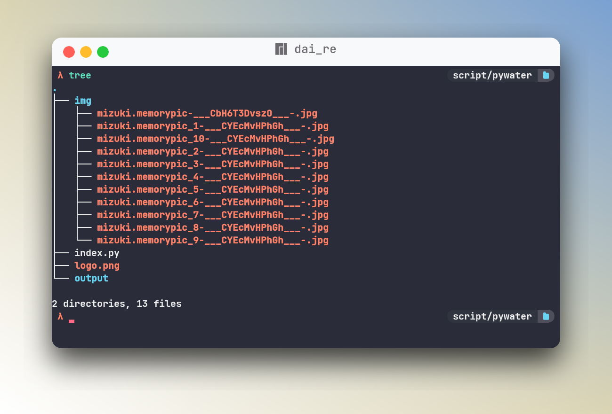

## python watermark 

this is a simple python code to add a watermark to a images.

<a href="https://t.me/mogionc">

</a>
<a href="https://paypal.me/dairewahandi?country.x=ID&locale.x=id_ID">

</a>
<a href="discordapp.com/users/692815201795571822">

</a>
<a href="https://githuh.com/dai-re">

</a>
<a href="https://facebook.com/deiterada">

</a>
<a href="https://instagram.com/dei.terada">

</a>
<a href="https://twittht.com/03ii00">

</a>


### create an img folder and output

```
Folder
├── img <== drop your images here
├── index.py
├── logo.png <== your watermark (.png)
└── output <== leave this enpty

```


### before


### after


